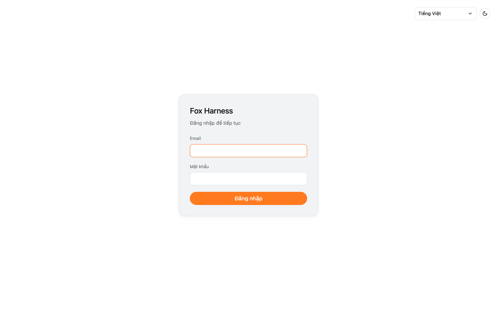

Fox Harness **không có đăng ký tự do**: tài khoản do quản trị viên (admin) tạo. Nếu chưa có tài khoản, hãy liên hệ admin
của nhóm bạn.

## Đăng nhập

1. Mở trang Fox Harness.
2. Nhập **Email** và **Mật khẩu**, bấm **Đăng nhập**.

Ở góc màn hình đăng nhập có thể đổi ngôn ngữ (Tiếng Việt / English) và giao diện sáng / tối.

Nếu bạn mở một đường dẫn tới đoạn chat (ví dụ `/chat/...`) khi chưa đăng nhập, sau khi đăng nhập Fox Harness sẽ mở đúng
đoạn chat đó.

## Thông báo hay gặp

| Thông báo                                              | Ý nghĩa                                                                                  |
| ------------------------------------------------------ | ---------------------------------------------------------------------------------------- |
| Email hoặc mật khẩu không đúng                         | Kiểm tra lại email và mật khẩu                                                           |
| Quá nhiều lần thử, vui lòng thử lại sau                | Đã nhập sai quá 10 lần trong một phút với email này — đợi một phút rồi thử lại           |
| Phiên đăng nhập đã hết hạn — vui lòng đăng nhập lại    | Bạn không dùng Fox Harness quá 1 giờ, hoặc admin vừa đổi vai trò / mật khẩu của bạn      |

## Đăng xuất

Bấm vào email của bạn ở cuối thanh bên → **Đăng xuất**, hoặc **Cài đặt → Hồ sơ → Đăng xuất**.

:::note[Quên mật khẩu?]
Chưa có chức năng tự đặt lại mật khẩu. Admin có thể đặt mật khẩu mới cho bạn (xem
[Quản lý người dùng](/docs/quan-tri/nguoi-dung/)).
:::
