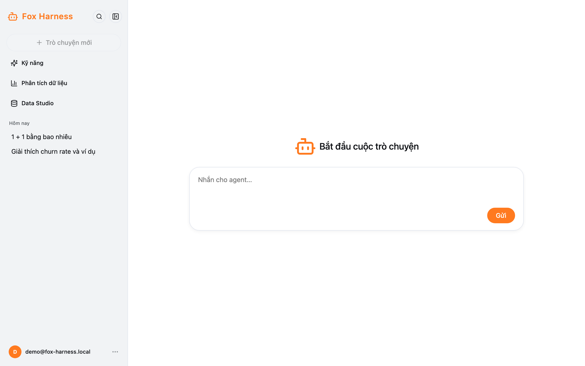
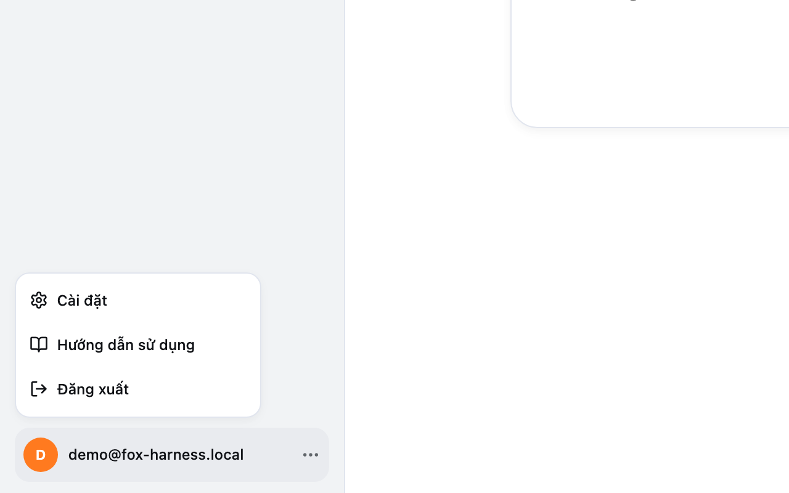
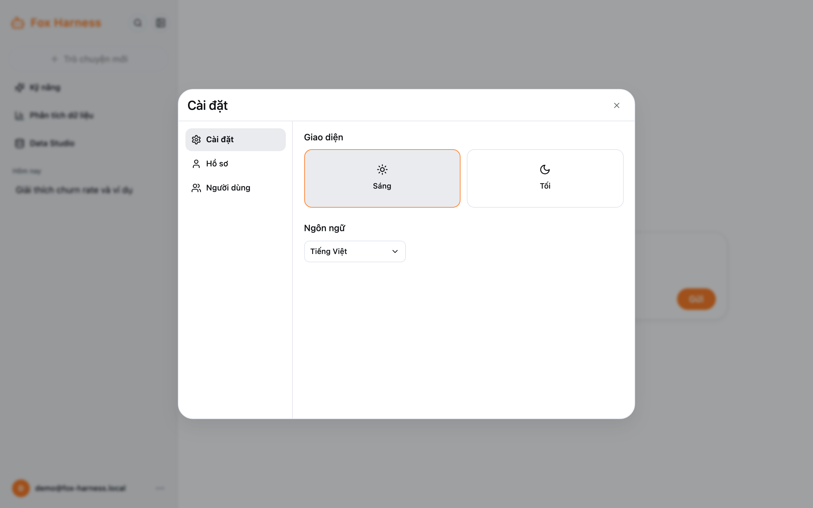

## Thanh bên

| Mục                     | Dùng để                                                                                      |
| ----------------------- | -------------------------------------------------------------------------------------------- |
| Kính lúp                | Tìm đoạn chat theo tên                                                                       |
| Nút thu gọn             | Thu thanh bên thành một cột biểu tượng (màn hình hẹp hơn 1024px sẽ tự thu gọn)               |
| **Trò chuyện mới**      | Mở một đoạn chat mới (bị mờ khi đoạn chat hiện tại còn trống)                                |
| **Kỹ năng**             | Xem và tạo skill — xem [Kỹ năng](/docs/chat/ky-nang/)                                         |
| **Phân tích dữ liệu**   | Mở danh sách dự án — xem [Phân tích dữ liệu](/docs/chat/phan-tich-du-lieu/)                   |
| **Data Studio**         | Hỏi dữ liệu của công ty — xem [Data Studio](/docs/data-studio/hoi-du-lieu/)                   |
| Lịch sử chat            | Các đoạn chat thường, nhóm theo Hôm nay / Hôm qua / 7 ngày trước / 30 ngày trước / Cũ hơn    |
| Email của bạn (cuối)    | Menu tài khoản: **Cài đặt**, **Hướng dẫn sử dụng**, **Đăng xuất**                             |

Đoạn chat trong dự án chỉ hiện trong trang dự án; đoạn chat Data Studio chỉ hiện trong Data Studio.

## Cài đặt

Mở menu tài khoản → **Cài đặt**.

| Tab             | Nội dung                                                     |
| --------------- | ------------------------------------------------------------ |
| **Cài đặt**     | **Giao diện** (Sáng / Tối) và **Ngôn ngữ** (Tiếng Việt / English) |
| **Hồ sơ**       | Email của bạn và nút **Đăng xuất**                           |
| **Người dùng**  | Chỉ admin thấy — xem [Quản lý người dùng](/docs/quan-tri/nguoi-dung/) |

Lựa chọn giao diện và ngôn ngữ được nhớ trên trình duyệt này.

