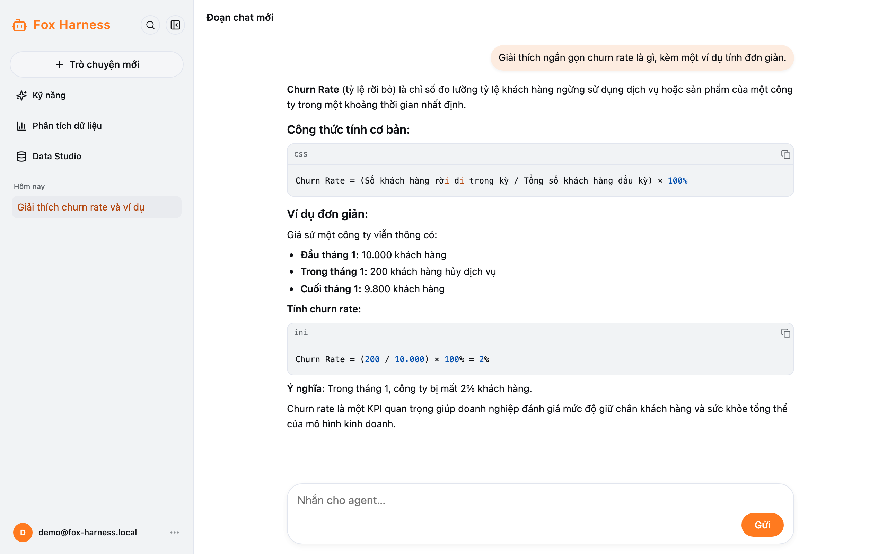
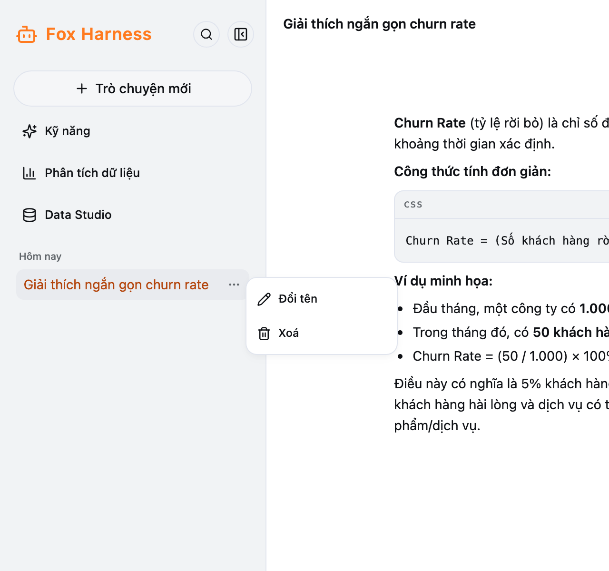

## Gửi tin nhắn

Gõ vào ô **Nhắn cho agent…** rồi bấm **Gửi** hoặc nhấn **Enter**. **Shift + Enter** để xuống dòng.

Trong lúc agent trả lời, dòng trạng thái hiện **Đang suy nghĩ…** hoặc **Đang chạy công cụ…** kèm thời gian. Mỗi lúc chỉ
có một câu trả lời: đợi xong (hoặc dừng) rồi mới gửi tin tiếp.

**Dừng:** trong lúc agent trả lời, nút **Gửi** đổi thành **Dừng**. Bấm để huỷ lượt này (hiện "Đã dừng.").

## Agent làm gì trong lúc trả lời

Mỗi lần agent dùng một công cụ, một dòng nhỏ hiện ra — bấm vào để xem chi tiết:

| Dòng hiện ra                          | Nghĩa là                                                          |
| ------------------------------------- | ----------------------------------------------------------------- |
| Đang tra cứu… / Đã tra cứu *n* nguồn  | Agent tìm trên web; bấm để xem danh sách nguồn                    |
| Đang đọc skill … / Đã đọc skill …     | Agent đang làm theo một [skill](/docs/chat/ky-nang/)               |
| Đang phân tích dữ liệu…               | Agent hỏi dữ liệu công ty; bấm để xem câu trả lời, biểu đồ, SQL và bảng |
| Đang dùng … / Đã dùng …               | Các công cụ khác                                                  |

Câu trả lời hiển thị dạng Markdown; khối code có nút **Sao chép**.

Model dùng cho đoạn chat do hệ thống chọn, người dùng không cần chọn.

## Quản lý đoạn chat

- **Mở lại:** bấm vào đoạn chat ở thanh bên; toàn bộ lịch sử (cả biểu đồ, kết quả công cụ) hiện lại. Có thể gửi tiếp như
  bình thường.
- **Tên:** đoạn chat tự đặt tên theo tin nhắn đầu. Để đổi tên, bấm vào tên ở đầu đoạn chat, hoặc rê chuột vào đoạn chat ở
  thanh bên → **…** → **Đổi tên** (tối đa 255 ký tự; Enter để lưu, Esc để huỷ). Tên bạn tự đặt sẽ không bị đổi lại.

- **Xoá:** thanh bên → **…** → **Xoá**. Không hoàn tác được — xem [Dữ liệu của bạn](/docs/khac/du-lieu-va-gioi-han/).
- **Chia sẻ đường dẫn:** mỗi đoạn chat có địa chỉ riêng (`/chat/...`), nhưng **chỉ chủ đoạn chat mở được**.

## Lỗi hay gặp

| Thông báo                                               | Cách xử lý                                                   |
| ------------------------------------------------------- | ------------------------------------------------------------ |
| Mất kết nối với agent. Tải lại trang để xem tiếp.       | Tải lại trang để xem tiếp                                    |
| Too many messages: at most 20 per minute…               | Đã gửi quá 20 tin trong một phút — đợi một chút rồi gửi lại |
| Không gọi được model (…)                                | Dịch vụ model đang lỗi — thử lại sau, nếu lặp lại báo admin  |
| Phiên trước không còn khả dụng — đã bắt đầu phiên mới   | Đoạn chat cũ đã bị xoá hoặc không còn — dùng đoạn chat mới  |
