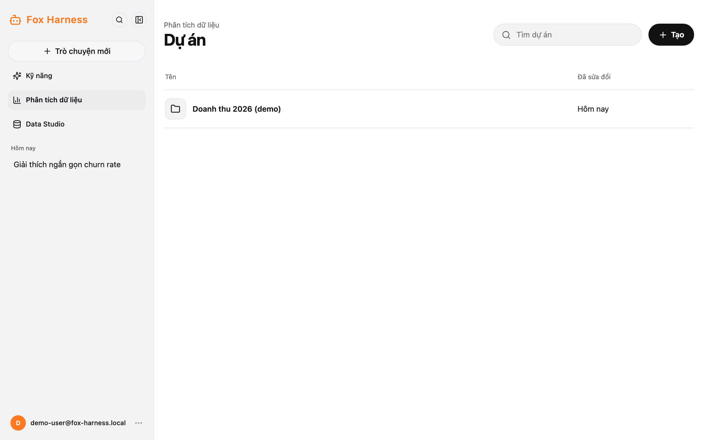
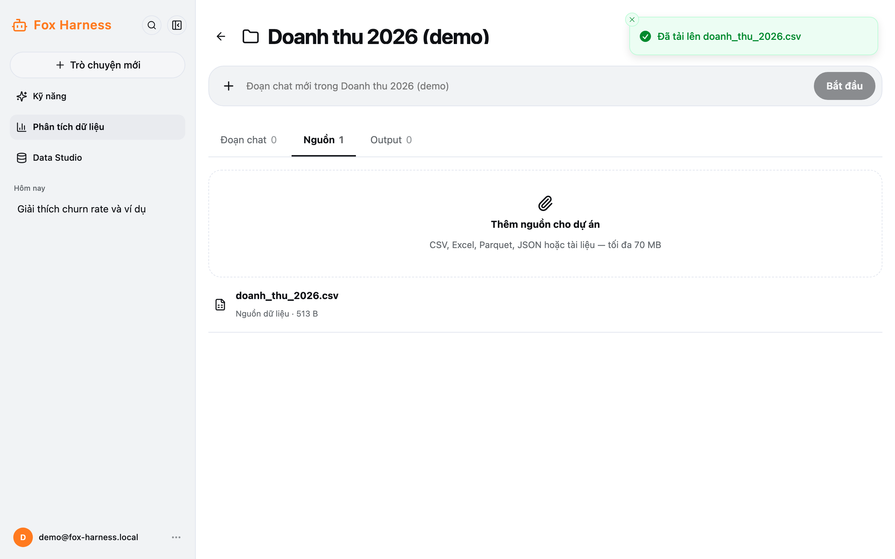
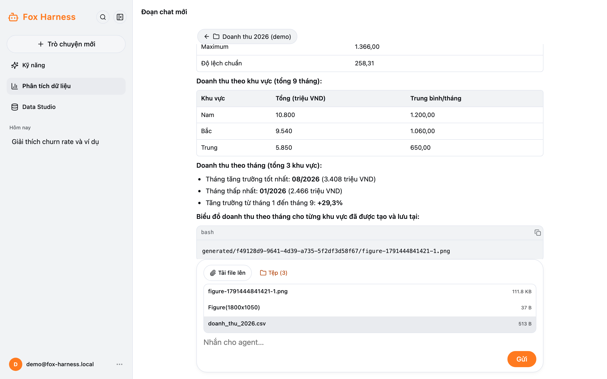
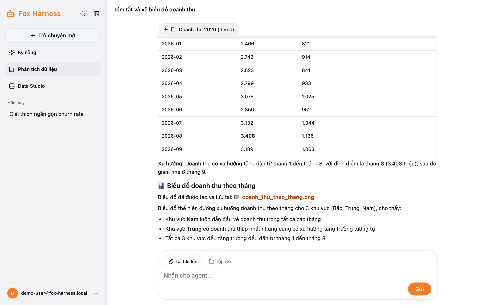

Dùng khi bạn muốn agent làm việc với **tệp của bạn**: CSV, Excel, Parquet, JSON hoặc tài liệu. Tệp và các đoạn chat liên
quan được gom vào một **dự án**.

## Tạo dự án

1. Thanh bên → **Phân tích dữ liệu**.
2. Bấm **Tạo**, nhập tên (tối đa 120 ký tự) → **Tạo dự án**.

Trong trang dự án có thể đổi tên (biểu tượng bút) hoặc xoá dự án (biểu tượng thùng rác). **Xoá dự án xoá luôn mọi đoạn chat
và tệp của nó.**

## Thêm dữ liệu

Tab **Nguồn** → **Thêm nguồn cho dự án**. Chọn được nhiều tệp, **tối đa 70 MB mỗi tệp**. Mọi đoạn chat trong dự án đều dùng
được các tệp này.

Trong một đoạn chat, thanh phía trên ô nhập có **Tải file lên** (thêm tệp cho riêng đoạn chat đó) và **Tệp (*n*)** (xem các
tệp đã có, kể cả tệp model tạo ra). Bấm vào ảnh để xem trước, tệp khác sẽ được tải về.

## Hỏi về dữ liệu

Gõ câu hỏi vào ô **Đoạn chat mới trong …** rồi bấm **Bắt đầu**. Ví dụ:

- "Tóm tắt file doanh_thu.xlsx, có bao nhiêu dòng, những cột nào?"
- "Vẽ biểu đồ doanh thu theo tháng và lưu thành ảnh."
- "Lọc các đơn hàng trên 10 triệu, xuất ra CSV."

Agent chạy code Python trên tệp của bạn. Tab **Đoạn chat** liệt kê các đoạn chat của dự án.

## Kết quả

Tab **Output**:

| Nhóm                       | Nội dung                                                                     |
| -------------------------- | ---------------------------------------------------------------------------- |
| Output dự án               | Kết quả dùng chung cho mọi đoạn chat trong dự án                             |
| Kết quả từ các đoạn chat   | Tệp model tạo trong từng đoạn chat; bấm **Đưa vào dự án** để dùng chung      |
| Tệp khác do model tạo      | Tệp phụ model tạo ra trong lúc làm                                           |

:::caution
Không tải lên dữ liệu mà bạn không được phép chia sẻ. Fox Harness hiện là bản dùng thử nội bộ.
:::
