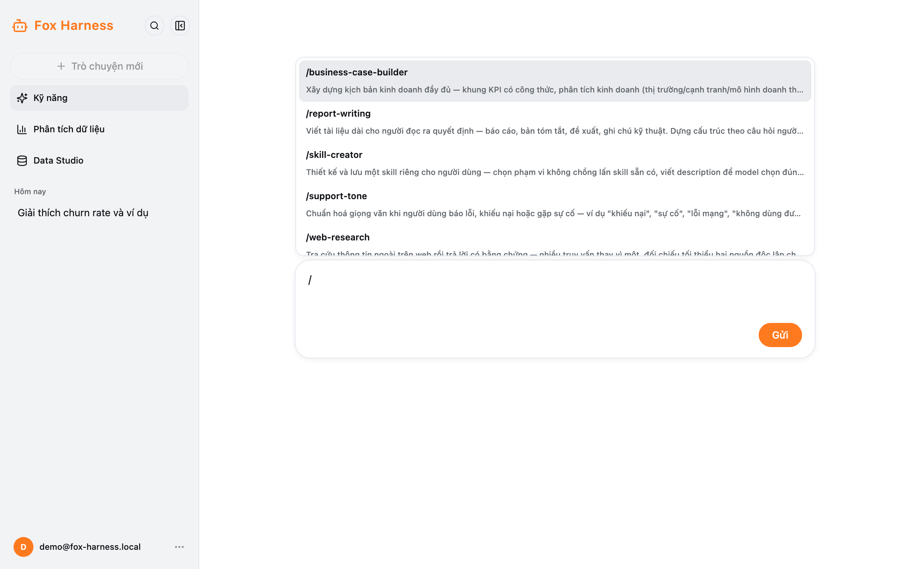
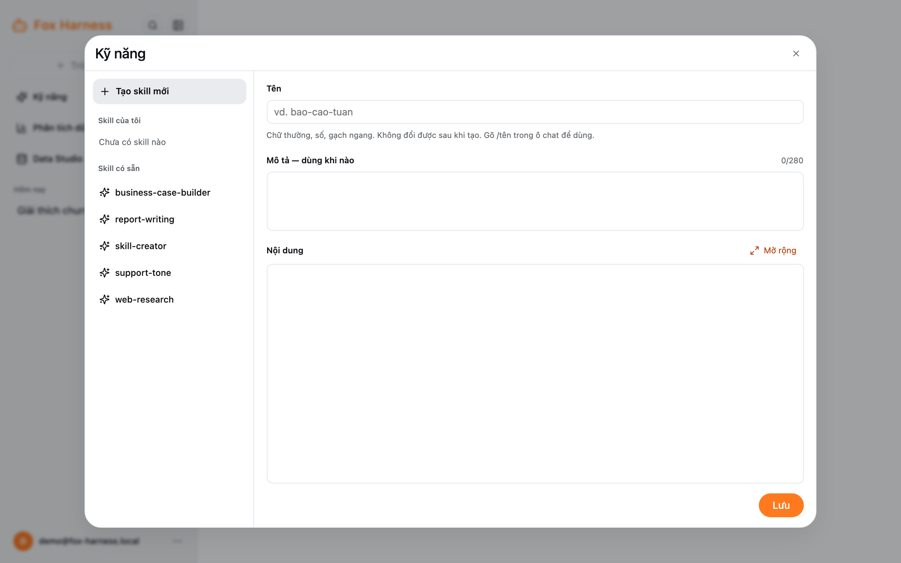
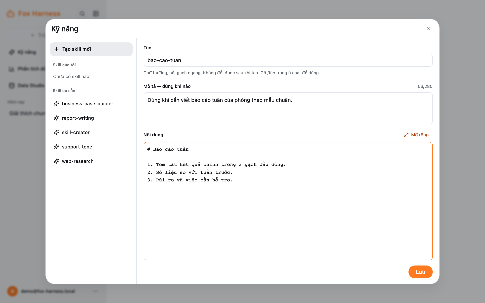

Skill là một bản hướng dẫn agent làm theo cho một việc lặp lại — ví dụ "viết báo cáo tuần theo mẫu của phòng".

## Dùng skill

Gõ `/` ở đầu ô chat: một danh sách skill hiện ra (skill của bạn có nhãn **của tôi**). Dùng ↑ ↓ để chọn, **Enter** hoặc
**Tab** để chèn, **Esc** để đóng. Sau đó viết tiếp yêu cầu và gửi.

Agent cũng tự đọc skill khi thấy phù hợp (hiện dòng "Đã đọc skill …").

## Xem và tạo skill

Thanh bên → **Kỹ năng**.

- **Skill có sẵn:** dùng chung cho mọi người, không sửa được.
- **Skill của tôi:** chỉ bạn thấy và dùng.

Tạo skill: bấm **Tạo skill mới**, điền:

| Ô                         | Quy định                                                                         |
| ------------------------- | -------------------------------------------------------------------------------- |
| **Tên**                   | Chữ thường, số, gạch ngang, 2–64 ký tự (vd. `bao-cao-tuan`). Không đổi được sau khi tạo |
| **Mô tả — dùng khi nào**  | Bắt buộc, tối đa 280 ký tự. Agent dựa vào đây để biết khi nào dùng skill         |
| **Nội dung**              | Bắt buộc, tối đa 64 KB. Viết các bước, mẫu, quy tắc agent cần làm theo           |

Bấm **Lưu**. Mỗi người có tối đa 50 skill. Thay đổi có hiệu lực từ tin nhắn tiếp theo, ở mọi đoạn chat.

Bạn cũng có thể nhờ agent tạo skill ngay trong đoạn chat, ví dụ: "Lưu cách làm vừa rồi thành skill tên bao-cao-tuan".
