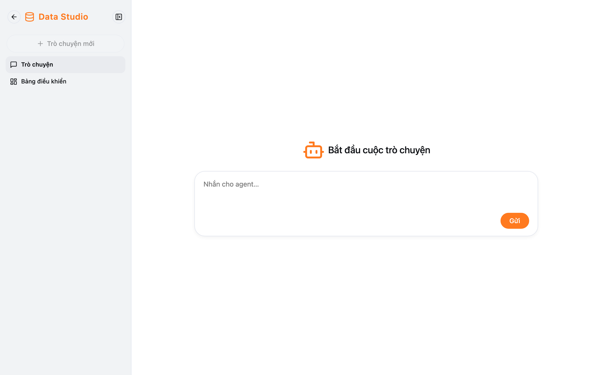
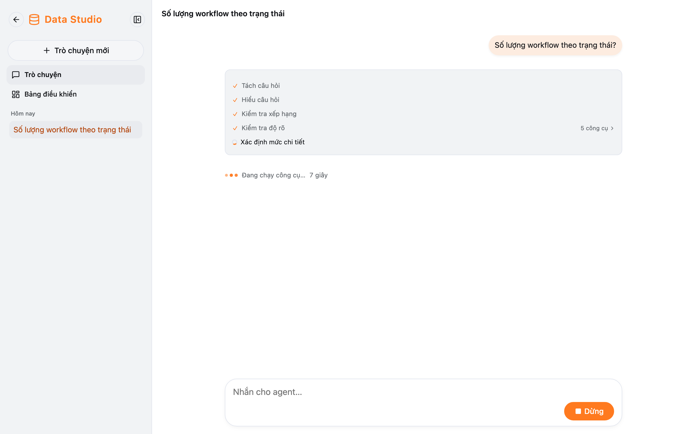
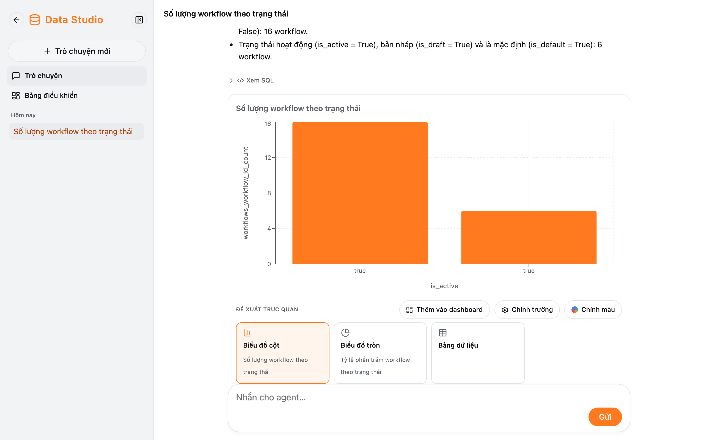

Data Studio trả lời câu hỏi về **dữ liệu của công ty** (các bảng admin đã mở cho bạn) bằng câu trả lời, biểu đồ và SQL.

## Mở Data Studio

Thanh bên → **Data Studio**. Thanh bên đổi sang Data Studio, với hai mục:

| Mục                 | Dùng để                                                              |
| ------------------- | -------------------------------------------------------------------- |
| **Trò chuyện**      | Hỏi dữ liệu; lịch sử chat Data Studio nằm ngay dưới                   |
| **Bảng điều khiển** | Dashboard của bạn — xem [Dashboard](/docs/data-studio/dashboards/)     |

Mũi tên **Quay lại Fox Harness** ở đầu thanh bên để trở về màn hình chat thường (menu Cài đặt / Đăng xuất nằm ở đó).

## Đặt câu hỏi

Gõ câu hỏi như hỏi đồng nghiệp, ví dụ:

- "Có bao nhiêu workflow đang chạy?"
- "Doanh thu theo tháng năm nay, so với năm ngoái."
- "Top 10 khách hàng theo số đơn trong quý 3."

Trong lúc chạy, các bước hiện lần lượt: Hiểu câu hỏi → Tìm dữ liệu → Dựng truy vấn → Chạy truy vấn → Viết câu trả lời. Một
câu hỏi có thể mất vài chục giây đến vài phút.

## Đọc câu trả lời

- **Các bước phân tích:** bấm để xem agent đã hiểu và tìm dữ liệu thế nào.
- **Câu trả lời** bằng chữ, kèm các giả định agent đã dùng (biểu tượng bóng đèn) — nên đọc để chắc kết quả đúng ý.
- **Xem SQL:** câu truy vấn thật đã chạy.
- **Biểu đồ** và **Đề xuất trực quan:** chọn kiểu khác (cột, đường, tròn, bảng dữ liệu, số liệu…). Bảng hiển thị tối đa
  100 dòng.
- **Câu hỏi gợi ý:** bấm để hỏi tiếp.

Bạn chỉ hỏi được các bảng và cột admin cho phép. Cột chứa dữ liệu nhạy cảm (PII) không bao giờ hiển thị cho người dùng
thường. Nếu agent báo không tìm thấy dữ liệu, có thể bảng đó chưa được mở cho bạn — hỏi admin.

:::tip
Trong chat thường, agent cũng có thể tự hỏi dữ liệu công ty (dòng "Đang phân tích dữ liệu…"). Bấm vào dòng đó để xem
biểu đồ và **Ghim vào dashboard**.
:::
