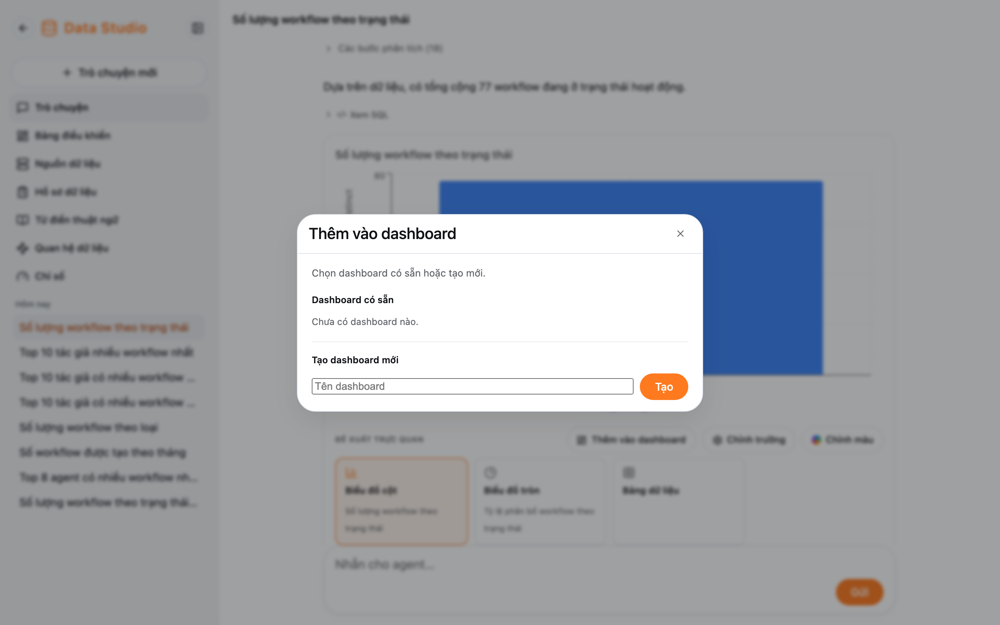

Dưới mỗi biểu đồ có ba nút:

| Nút                    | Làm gì                                                                                         |
| ---------------------- | ---------------------------------------------------------------------------------------------- |
| **Thêm vào dashboard** | Ghim biểu đồ vào một dashboard có sẵn, hoặc tạo dashboard mới ngay trong hộp thoại             |
| **Chỉnh trường**       | Đặt tên biểu đồ, chọn trục X, các chuỗi giá trị Y và nhãn của chúng (cho biểu đồ cột, đường, vùng, phân tán, kết hợp) |
| **Chỉnh màu**          | Chọn màu cho từng chuỗi (không áp dụng cho dạng bảng)                                          |

Bấm **Áp dụng** để lưu. Thay đổi được lưu lại, nên biểu đồ trên dashboard cũng đổi theo.

Biểu đồ thuộc về người đã hỏi: người khác không xem hay sửa được biểu đồ của bạn.
