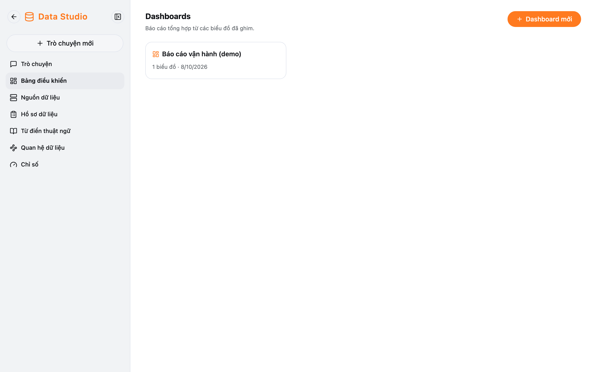
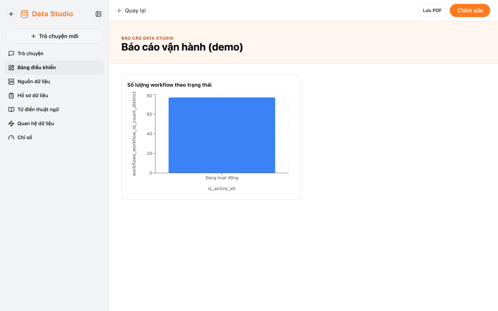
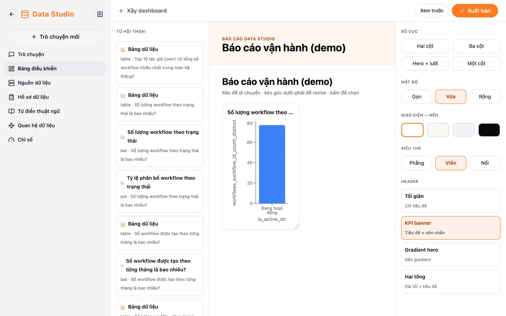

Mỗi người có **dashboard riêng**: chỉ bạn thấy, sửa và xoá được dashboard của mình.

## Danh sách dashboard

Data Studio → **Bảng điều khiển**.

- **Dashboard mới:** tạo một dashboard trống ("Dashboard chưa đặt tên") và mở trình dựng.
- Bấm một dashboard để xem.
- Biểu tượng thùng rác để xoá (có hỏi lại).

## Xem dashboard

- **Chỉnh sửa:** mở trình dựng.
- **Lưu PDF:** mở hộp thoại in của trình duyệt — chọn "Lưu dưới dạng PDF".

## Dựng dashboard

| Vùng              | Nội dung                                                                                         |
| ----------------- | ------------------------------------------------------------------------------------------------ |
| Bên trái          | **Từ hội thoại:** biểu đồ bạn đã tạo, bấm để thêm. **Thêm widget → Text** để thêm đoạn chữ, tiêu đề |
| Giữa              | Ô **Tiêu đề dashboard** (cách duy nhất để đổi tên). Kéo widget để di chuyển, kéo góc dưới-phải để đổi kích thước, biểu tượng thùng rác để xoá widget |
| Bên phải          | **Bố cục** (Hai cột, Ba cột, Hero + lưới, Một cột), **Mật độ**, **Nền**, **Kiểu thẻ**, **Header** |

Lưu bằng **Xem trước** (lưu rồi xem) hoặc **Xuất bản**.

:::caution[Nhớ lưu]
Thay đổi chỉ được lưu khi bấm **Xem trước** hoặc **Xuất bản**. Bấm quay lại khi chưa lưu sẽ **mất thay đổi mà không hỏi**.
:::
