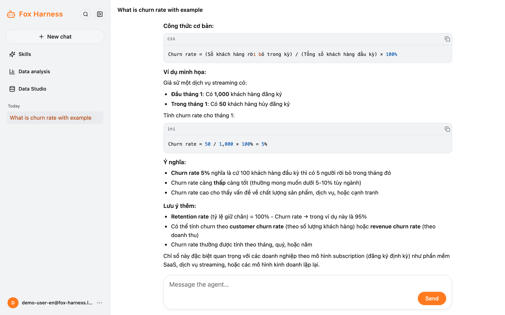
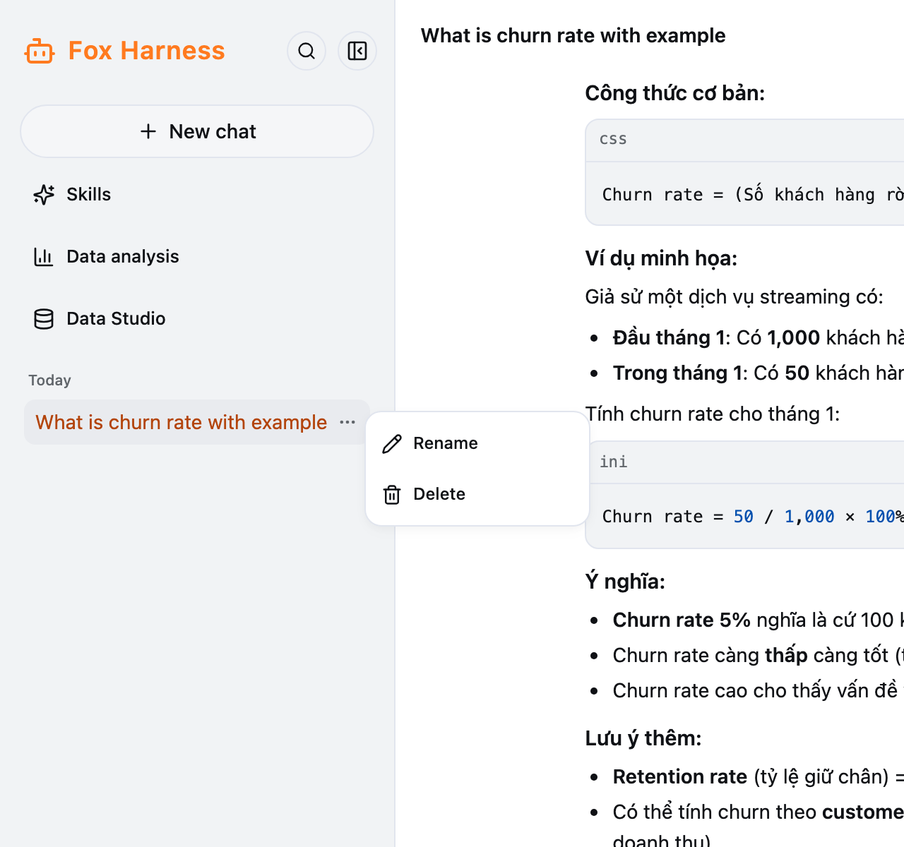

## Send a message

Type in the **Message the agent…** box, then click **Send** or press **Enter**. **Shift + Enter** starts a new line.

While the agent replies, a status line shows **Thinking…** or **Running a tool…** with a timer. There is one reply at a
time: wait for it to finish (or stop it) before sending the next message.

**Stop:** while the agent replies, the **Send** button becomes **Stop**. Click it to cancel this turn ("Stopped." appears).

## What the agent is doing

Each time the agent uses a tool, a small line appears — click it for the details:

| Line                                   | Meaning                                                                         |
| -------------------------------------- | ------------------------------------------------------------------------------- |
| Searching… / Searched *n* sources      | The agent searched the web; click to see the sources                            |
| Reading skill … / Read skill …         | The agent is following a [skill](/docs/en/chat/skills/)                         |
| Analyzing data…                        | The agent asked about company data; click for the answer, chart, SQL and table  |
| Using … / Used …                       | Other tools                                                                     |

Answers are shown as Markdown; code blocks have a **Copy** button.

The model is chosen by the system; there is nothing to pick.

## Managing chats

- **Reopen:** click a chat in the sidebar; its whole history (charts and tool results too) comes back. You can carry on
  as usual.
- **Title:** a chat names itself after your first message. To rename it, click the title at the top of the chat, or
  hover the chat in the sidebar → **…** → **Rename** (up to 255 characters; Enter saves, Esc cancels). A title you set
  yourself is never overwritten.
- **Delete:** sidebar → **…** → **Delete**. This cannot be undone — see [Your data](/docs/en/more/data-and-limits/).
- **Sharing a link:** every chat has its own address (`/chat/...`), but **only its owner can open it**.

## Common errors

| Message                                                          | What to do                                                    |
| ---------------------------------------------------------------- | ------------------------------------------------------------- |
| Lost connection to the agent. Reload the page to continue.       | Reload the page                                               |
| Too many messages: at most 20 per minute…                        | You sent over 20 messages in a minute — wait a moment, resend |
| Model call failed (…)                                            | The model service is failing — try later; if it keeps failing, tell an admin |
| Previous session is no longer available — started a new one      | The old chat was deleted or is gone — use the new chat        |
