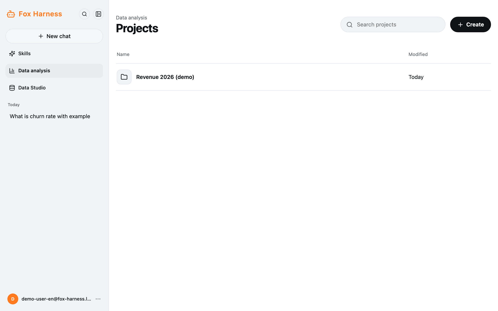
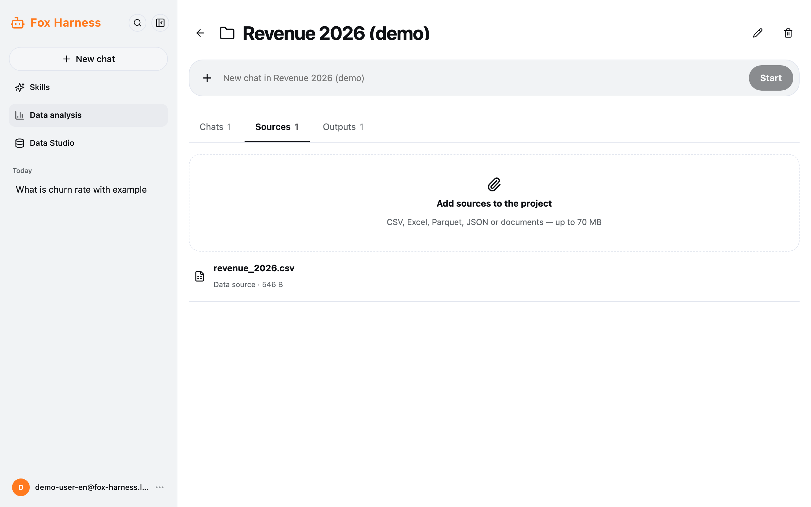
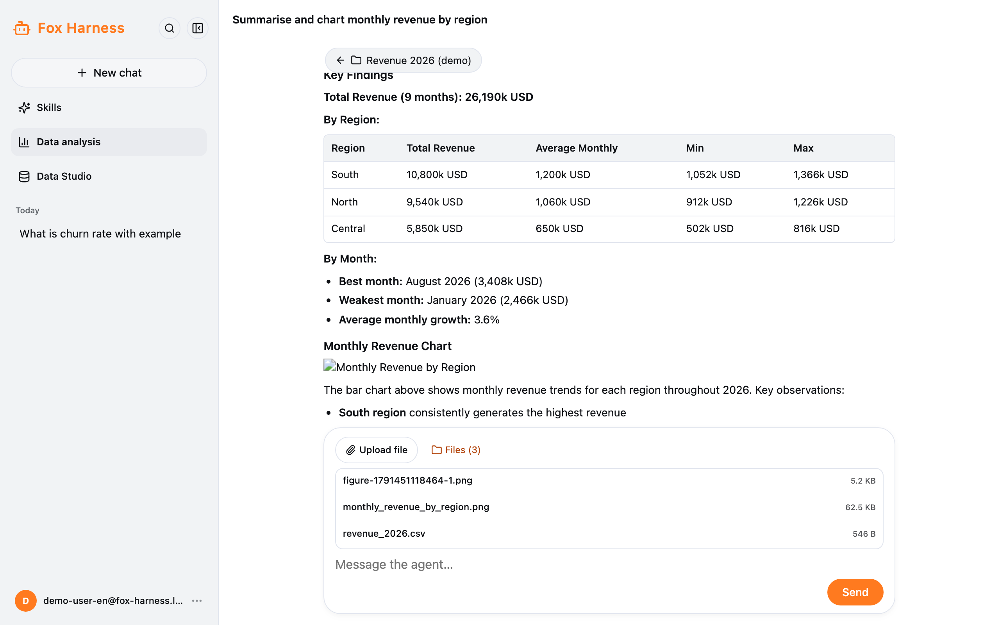
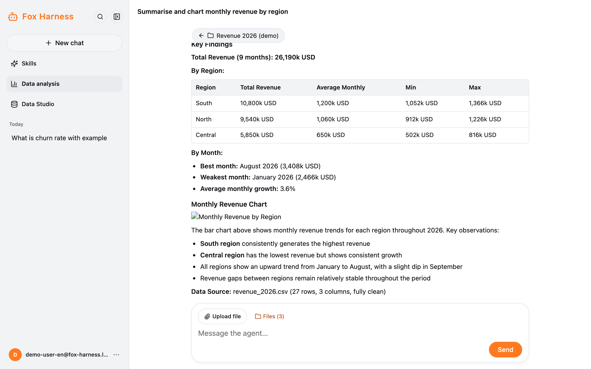

Use this when you want the agent to work with **your own files**: CSV, Excel, Parquet, JSON or documents. The files and
the chats about them are kept together in a **project**.

## Create a project

1. Sidebar → **Data analysis**.
2. Click **Create**, enter a name (up to 120 characters) → **Create project**.

On the project page you can rename it (pencil icon) or delete it (bin icon). **Deleting a project deletes all of its
chats and files.**

## Add data

The **Sources** tab → **Add sources to the project**. You can pick several files, **up to 70 MB each**. Every chat in the
project can use them.

Inside a chat, the bar above the message box has **Upload file** (a file for that chat only) and **Files (*n*)** (the
files it has, including the ones the model made). Click an image to preview it; other files download.

## Ask about the data

Type your question in the **New chat in …** box and click **Start**. For example:

- "Summarise sales.xlsx: how many rows, which columns?"
- "Chart revenue by month and save it as an image."
- "Filter orders above 10,000 and export them to CSV."

The agent runs Python code on your files. The **Chats** tab lists the project's chats.

## Results

The **Output** tab:

| Group                              | Contents                                                                    |
| ---------------------------------- | --------------------------------------------------------------------------- |
| Project outputs                    | Results shared by every chat in the project                                 |
| Results from chats                 | Files the model made in each chat; click **Add to project** to share one    |
| Other files written by the model   | Side files the model wrote while working                                    |

:::caution
Don't upload data you are not allowed to share. Fox Harness is an internal trial.
:::
