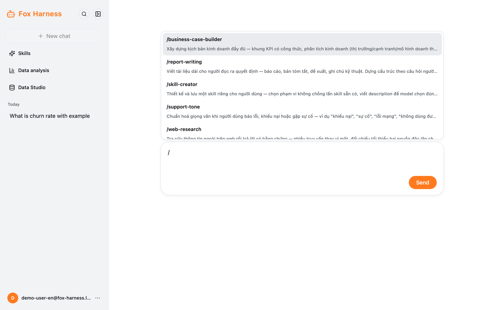
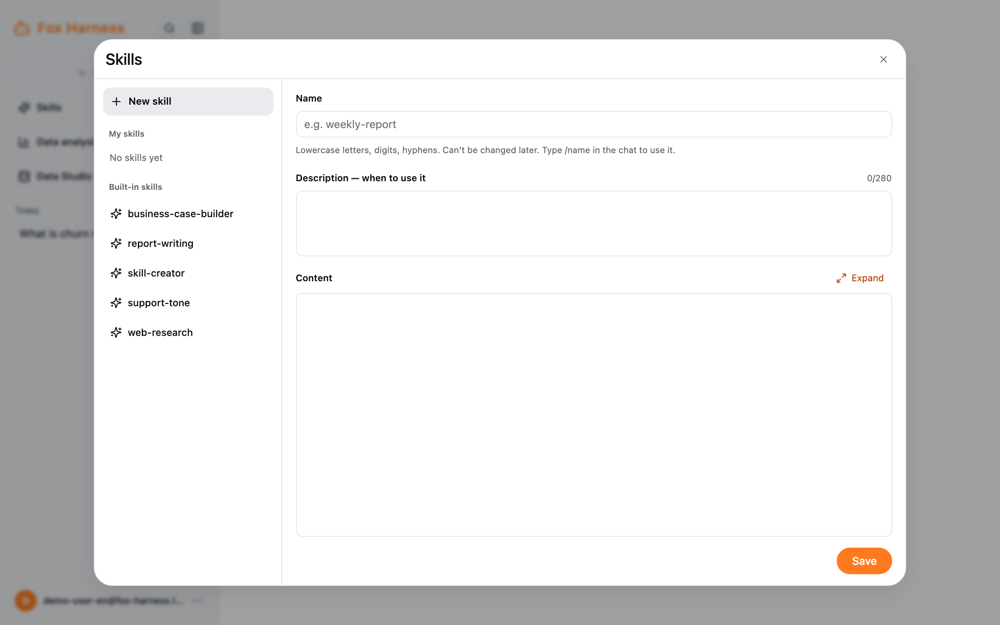
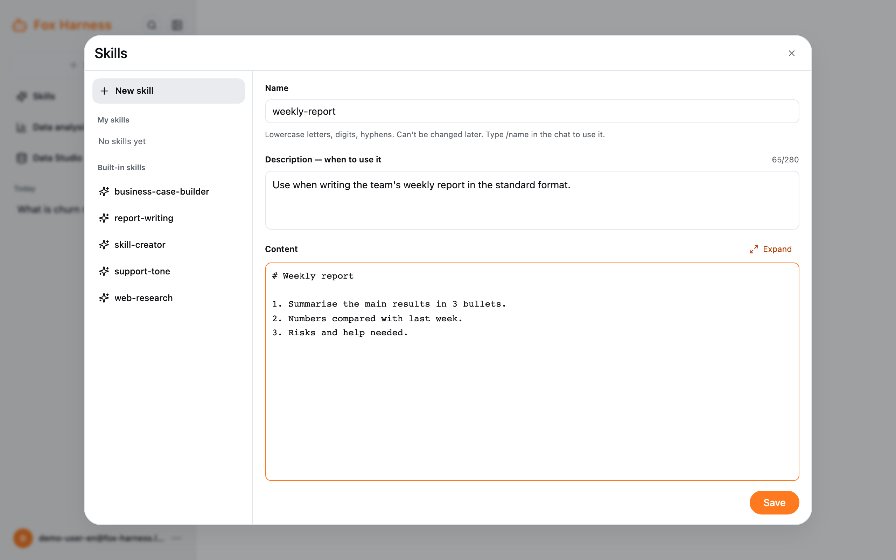

A skill is a set of instructions the agent follows for a recurring job — for example "write the team's weekly report in
our format".

## Use a skill

Type `/` at the start of the message box: a list of skills appears (yours are labelled **mine**). Use ↑ ↓ to pick,
**Enter** or **Tab** to insert, **Esc** to close. Then write the rest of your request and send it.

The agent also reads a skill by itself when it fits (a "Read skill …" line appears).

## See and create skills

Sidebar → **Skills**.

- **Built-in skills:** shared by everyone, read-only.
- **My skills:** only you see and use them.

To create one, click **New skill** and fill in:

| Field                             | Rules                                                                              |
| --------------------------------- | ---------------------------------------------------------------------------------- |
| **Name**                          | Lowercase letters, digits, hyphens, 2–64 characters (e.g. `weekly-report`). Cannot be changed later |
| **Description — when to use it**  | Required, up to 280 characters. The agent uses it to decide when the skill applies |
| **Content**                       | Required, up to 64 KB. The steps, templates and rules the agent must follow        |

Click **Save**. Each person can have up to 50 skills. Changes apply from the next message, in every chat.

You can also ask the agent to make a skill from a chat, for example: "Save what you just did as a skill called
weekly-report".
