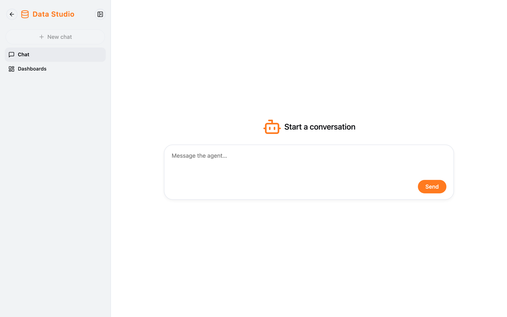
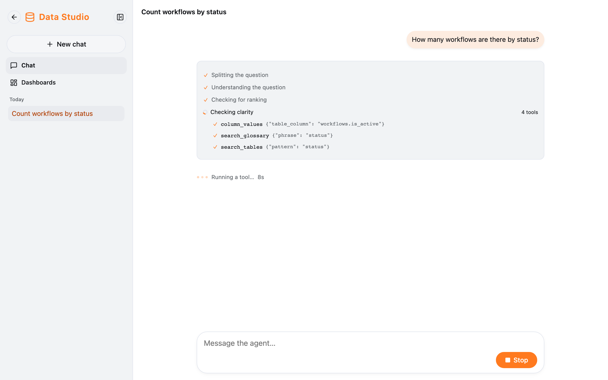
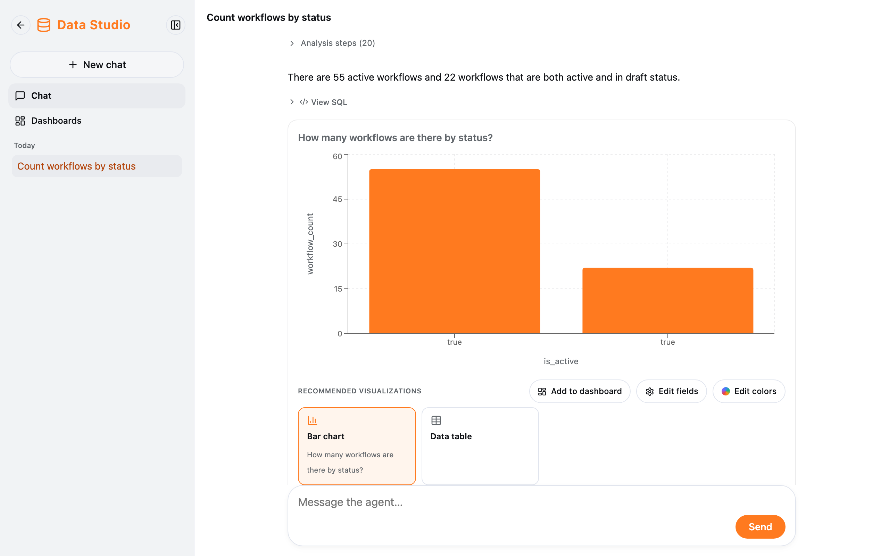

Data Studio answers questions about **company data** (the tables an admin opened to you) with an answer, a chart and the
SQL behind it.

## Open Data Studio

Sidebar → **Data Studio**. The sidebar switches to Data Studio, with two sections:

| Section          | What it does                                                         |
| ---------------- | -------------------------------------------------------------------- |
| **Chat**         | Ask about data; your Data Studio chats are listed below it           |
| **Dashboards**   | Your dashboards — see [Dashboards](/docs/en/data-studio/dashboards/) |

The **Back to Fox Harness** arrow at the top of the sidebar returns to the regular chat screen (where Settings and Logout
are).

## Ask a question

Ask as you would ask a colleague, for example:

- "How many workflows are running?"
- "Revenue by month this year compared with last year."
- "Top 10 customers by number of orders in Q3."

While it runs, its steps appear one by one (understanding the question, finding the data, building and running the
query, writing the answer). A question can take from a few seconds to a few minutes.

## Reading the answer

- **Analysis steps:** click to see how the agent understood the question and found the data.
- **The answer** in words, with the assumptions the agent made (lightbulb icon) — read them to be sure it answered what
  you meant.
- **View SQL:** the exact query that ran.
- **The chart** and **Recommended visualizations:** switch to another view (bar, line, pie, data table, figure…). The
  table shows up to 100 rows.
- **Suggested questions:** click one to ask it next.

You can only query the tables and columns an admin allows. Columns holding personal data (PII) are never shown to regular
users. If the agent says it cannot find the data, that table may not be open to you — ask an admin.

:::tip
In a regular chat the agent can also ask about company data by itself (an "Analyzing data…" line). Click that line to see
the chart and **Pin to dashboard**.
:::
