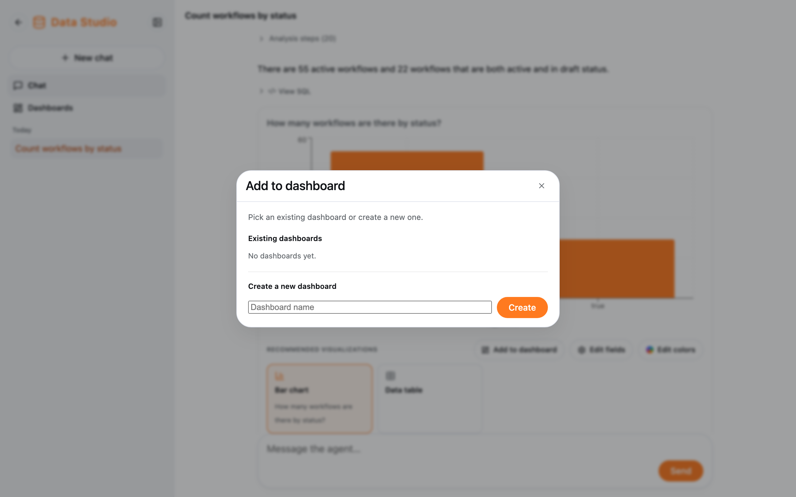

Each chart has three buttons:

| Button               | What it does                                                                                     |
| -------------------- | ------------------------------------------------------------------------------------------------ |
| **Add to dashboard** | Pin the chart to one of your dashboards, or create a new dashboard right in the dialog           |
| **Edit fields**      | Name the chart, pick the X axis, the Y series and their labels (bar, line, area, scatter, combo charts) |
| **Edit colors**      | Pick a color for each series (not for tables)                                                    |

Click **Apply** to save. Edits are saved, so the chart changes on your dashboards too.

A chart belongs to whoever asked the question: nobody else can see or edit your charts.
