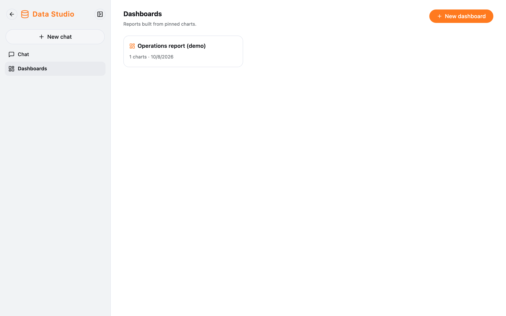
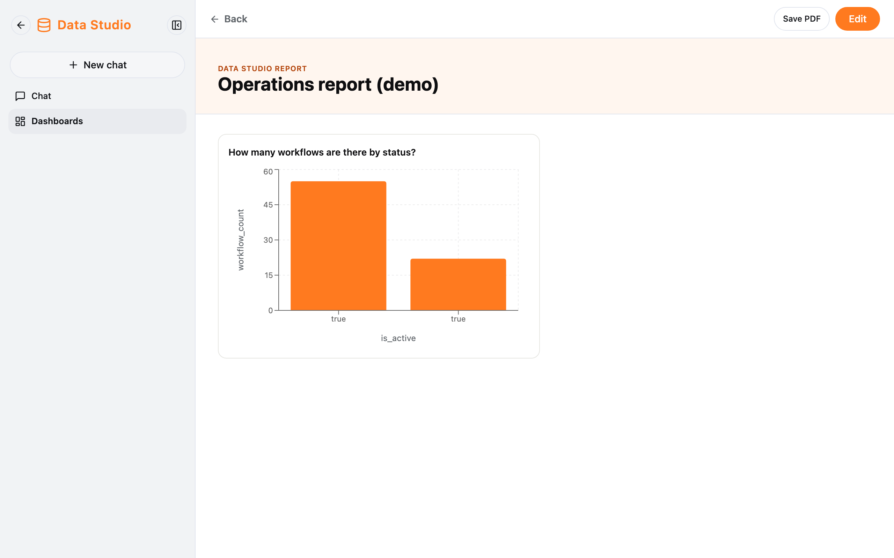
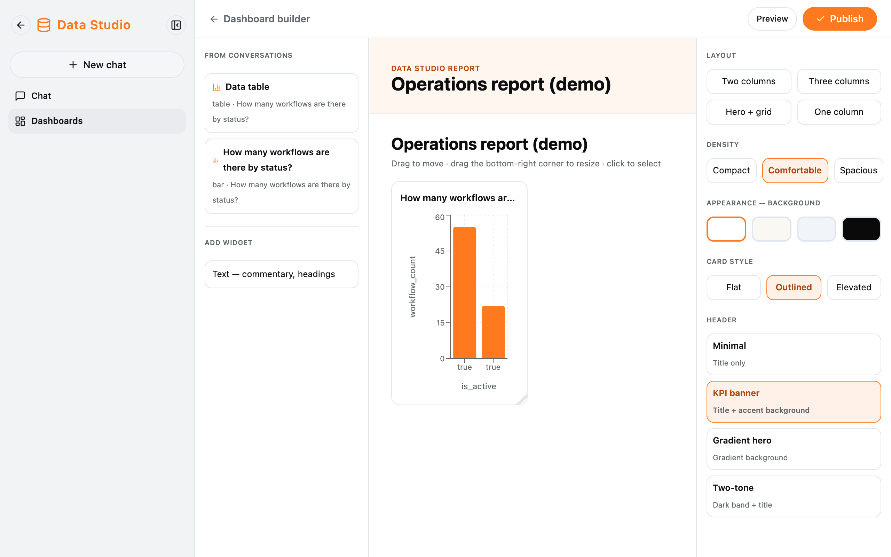

Everyone has **their own dashboards**: only you can see, edit and delete yours.

## Your dashboards

Data Studio → **Dashboards**.

- **New dashboard:** creates an empty dashboard ("Untitled dashboard") and opens the builder.
- Click a dashboard to view it.
- The bin icon deletes one (you are asked first).

## Viewing a dashboard

- **Edit:** opens the builder.
- **Save PDF:** opens the browser's print dialog — choose "Save as PDF".

## Building a dashboard

| Area     | Contents                                                                                                   |
| -------- | ---------------------------------------------------------------------------------------------------------- |
| Left     | **From conversations:** your charts, click one to add it. **Add widget → Text** for commentary and headings |
| Middle   | The **Dashboard title** box (the only way to rename it). Drag a widget to move it, drag its bottom-right corner to resize, the bin icon removes it |
| Right    | **Layout** (Two columns, Three columns, Hero + grid, One column), **Density**, **Background**, **Card style**, **Header** |

Save with **Preview** (saves, then shows it) or **Publish**.

:::caution[Remember to save]
Changes are saved only when you click **Preview** or **Publish**. Going back before that **discards them without asking**.
:::
