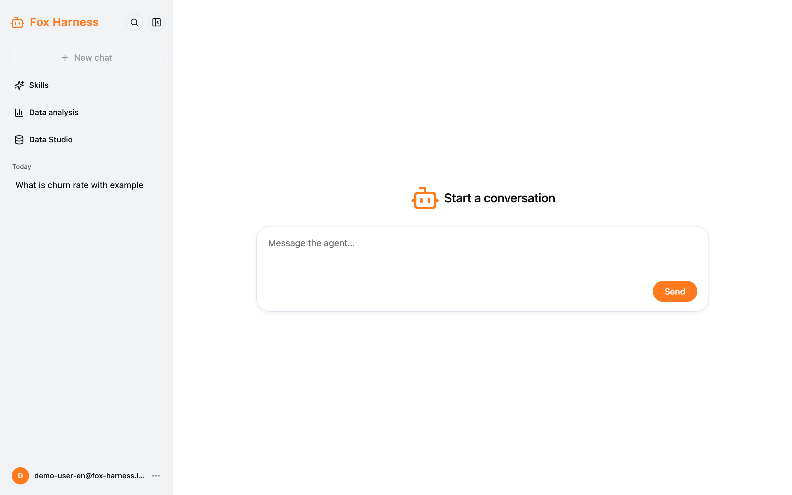
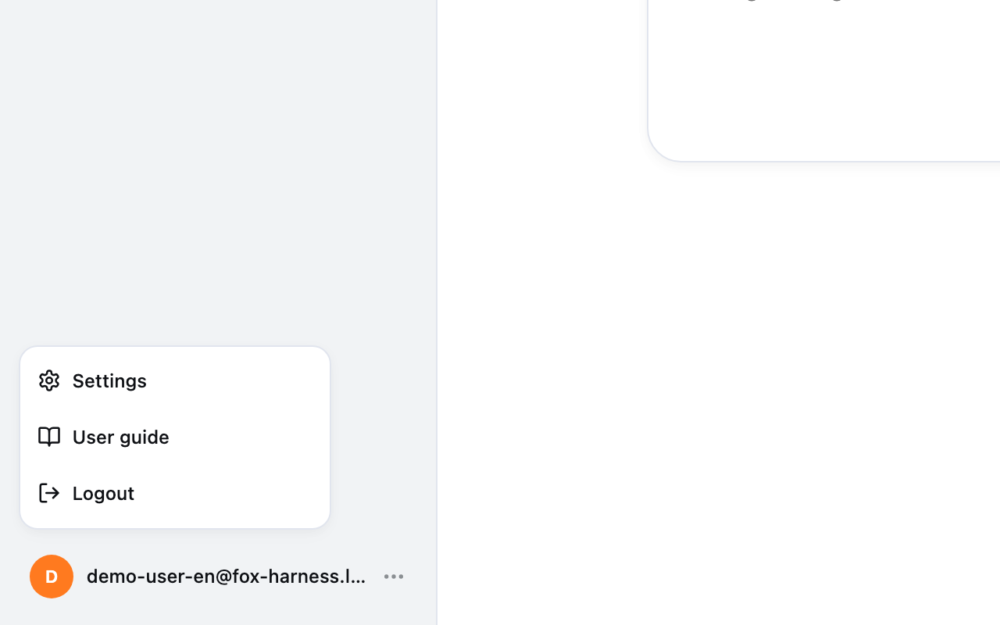
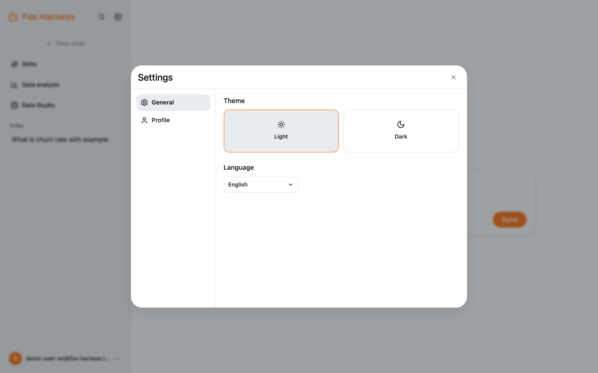

## Sidebar

| Item                    | What it does                                                                                    |
| ----------------------- | ----------------------------------------------------------------------------------------------- |
| Magnifier               | Search your chats by title                                                                      |
| Collapse button         | Shrink the sidebar to a column of icons (it collapses by itself on screens narrower than 1024px) |
| **New chat**            | Start a new chat (greyed out while the current chat is still empty)                             |
| **Skills**              | See and create skills — see [Skills](/docs/en/chat/skills/)                                     |
| **Data analysis**       | Open your projects — see [Data analysis](/docs/en/chat/data-analysis/)                          |
| **Data Studio**         | Ask about company data — see [Data Studio](/docs/en/data-studio/asking/)                        |
| Chat history            | Your regular chats, grouped as Today / Yesterday / Previous 7 Days / Previous 30 Days / Older   |
| Your email (bottom)     | The account menu: **Settings**, **User guide**, **Logout**                                      |

Project chats are listed on their project's page; Data Studio chats are listed inside Data Studio.

## Settings

Open the account menu → **Settings**.

| Tab             | Contents                                                          |
| --------------- | ----------------------------------------------------------------- |
| **General**     | **Theme** (Light / Dark) and **Language** (Tiếng Việt / English)  |
| **Profile**     | Your email and a **Logout** button                                |

Your theme and language are remembered in this browser.

