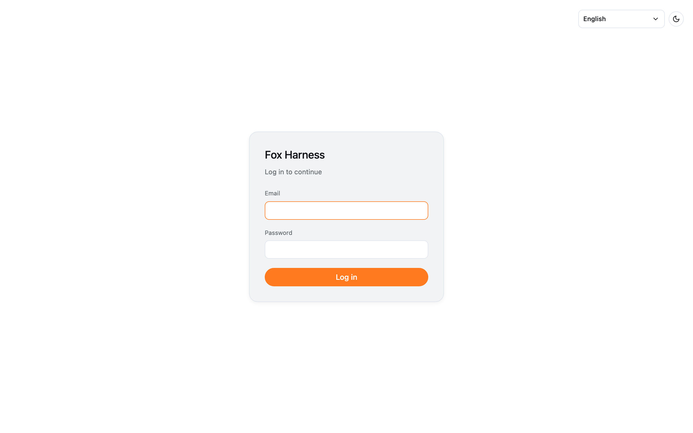

Fox Harness has **no sign-up**: accounts are created by an administrator (admin). If you don't have one yet, ask your
team's admin.

## Log in

1. Open Fox Harness.
2. Enter your **Email** and **Password**, then click **Log in**.

The corner of the login screen lets you switch the language (Tiếng Việt / English) and the light / dark theme.

If you open a link to a chat (e.g. `/chat/...`) before logging in, Fox Harness opens that chat once you have logged in.

## Common messages

| Message                                   | Meaning                                                                                 |
| ----------------------------------------- | --------------------------------------------------------------------------------------- |
| Invalid email or password                 | Check your email and password                                                           |
| Too many attempts, try again shortly      | More than 10 failed attempts in a minute for this email — wait a minute and try again    |
| Session expired — please log in again     | You haven't used Fox Harness for over an hour, or an admin changed your role / password |

## Log out

Click your email at the bottom of the sidebar → **Logout**, or **Settings → Profile → Logout**.

:::note[Forgot your password?]
There is no self-service password reset yet. Ask an admin to set a new password for you.
:::
