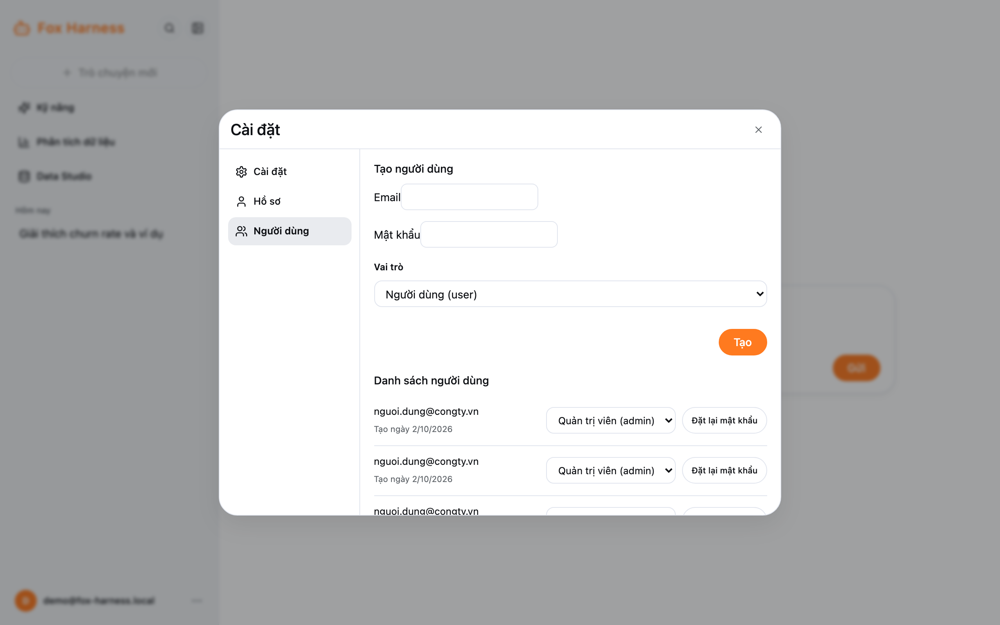

:::note
Chỉ tài khoản có vai trò **admin** thấy các mục trong phần Quản trị.
:::

Mở menu tài khoản → **Cài đặt** → tab **Người dùng**.

## Vai trò

| Vai trò                     | Được làm                                                                                   |
| --------------------------- | ------------------------------------------------------------------------------------------ |
| **Người dùng (user)**       | Chat, dự án, skill, hỏi dữ liệu trên các bảng/cột được cho phép, dashboard riêng            |
| **Quản trị viên (admin)**   | Mọi thứ của user, thêm: quản lý người dùng, cấu hình nguồn dữ liệu, xem mọi bảng đã bật     |

## Tạo người dùng

Điền **Email**, **Mật khẩu** (ít nhất 8 ký tự), chọn **Vai trò** → **Tạo**. Gửi email và mật khẩu cho người đó qua kênh an
toàn; họ đăng nhập ngay được.

## Đổi vai trò, đặt lại mật khẩu

Trong **Danh sách người dùng**:

- Đổi **vai trò** bằng ô chọn trên dòng của người đó.
- **Đặt lại mật khẩu:** nhập mật khẩu mới (ít nhất 8 ký tự) → **Lưu**.

Cả hai việc đều **đăng xuất người đó khỏi mọi thiết bị**. Bạn không thể tự gỡ vai trò admin của chính mình.

Hiện chưa có chức năng xoá hay khoá tài khoản.
