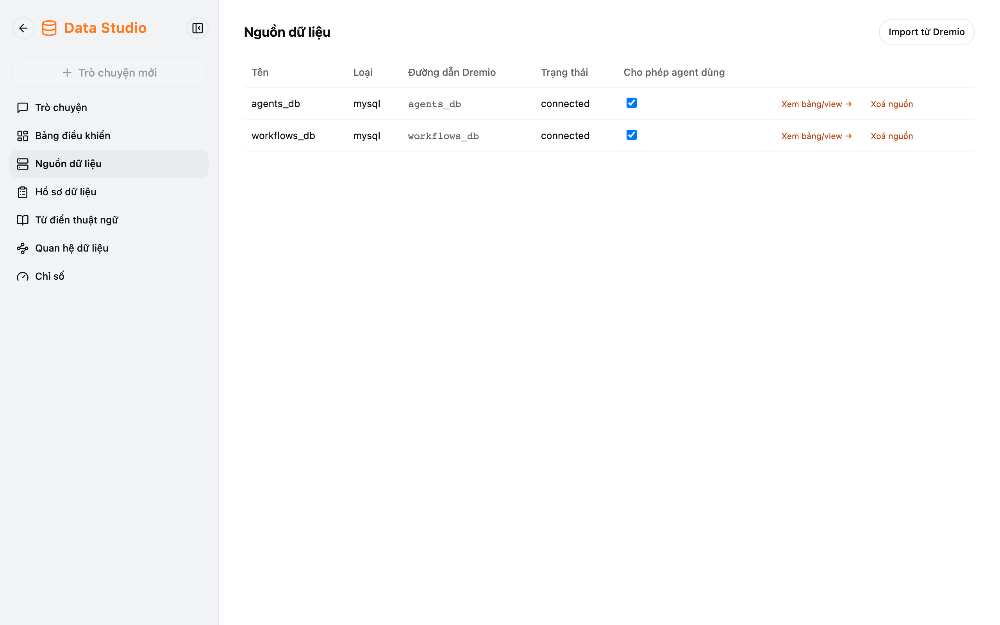

Các màn này nằm trong thanh bên Data Studio, chỉ admin thấy. Chúng quyết định Data Studio **hỏi được dữ liệu nào** và
**hiểu dữ liệu ra sao**.

## Nguồn dữ liệu

1. **Import từ Dremio:** chọn nguồn → **Đồng bộ đã chọn** (lấy cả nguồn), hoặc **Chọn bảng…** để chỉ import một số bảng.
2. Bật **Cho phép agent dùng** cho nguồn.
3. **Xem bảng/view →** để mô tả từng bảng:

| Cột                       | Ý nghĩa                                                                                     |
| ------------------------- | ------------------------------------------------------------------------------------------- |
| Tên hiển thị, Mô tả       | Giúp agent tìm đúng bảng — viết như giải thích cho người mới                                |
| Từ đồng nghĩa             | Các cách gọi khác, ngăn cách bằng dấu phẩy                                                  |
| Hiển thị                  | Tắt để agent bỏ qua bảng                                                                    |
| Dữ liệu nhạy cảm (PII)    | Cột PII không bao giờ hiển thị cho user                                                     |
| **Cho phép role user**    | Mặc định chỉ admin hỏi được. Bật để user hỏi được bảng/cột này (bật cho bảng sẽ mở mọi cột không PII của nó) |

**Xem cột →** để mô tả cột: vai trò (dimension / measure / key), kiểu ngữ nghĩa, phép tổng hợp. Thay đổi được lưu khi rời
khỏi ô.

## Từ điển thuật ngữ, Quan hệ dữ liệu, Chỉ số

| Màn                     | Dùng để                                                                         |
| ----------------------- | ------------------------------------------------------------------------------- |
| **Từ điển thuật ngữ**   | Định nghĩa thuật ngữ nghiệp vụ (vd. "khách hàng active") và từ đồng nghĩa       |
| **Quan hệ dữ liệu**     | Khai báo cách nối hai bảng (cột nối, 1:1 / 1:N / N:N, left / inner)             |
| **Chỉ số**              | Định nghĩa chỉ số chuẩn (bảng, cột đo, phép tổng hợp); đánh dấu **Đã xác minh** |

:::caution
Xoá thuật ngữ, quan hệ hay chỉ số **không hỏi lại**.
:::

## Hồ sơ dữ liệu

Màn **Hồ sơ dữ liệu** (giao diện tiếng Anh) dùng để mô tả kỹ từng bảng và cột của một nguồn, có gợi ý bằng AI, chạy thử
SQL, xuất / nhập hồ sơ dạng JSON và xuất tài liệu `.docx` cho đội dữ liệu.

Đồng bộ, import, gợi ý AI và chạy SQL bị giới hạn 10 lần mỗi phút cho mỗi loại việc.
